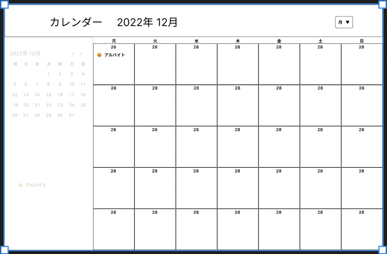

# オブジェクト指向プログラミングおよび演習 第○○回進捗レポート

## 作成者
- 学籍番号：k21017
- 氏名：岩藤正治
- グループ： 3
    - メンバー
        - K21116　水谷祐正（チームリーダー）
        - K21017　岩藤正治
        - K21065　島田優希
        - K21099　林航平
        - K21117　三澤一太
        - K21103　二見龍介
        - K21127　山田遼太

## 仕様
- ログイン機能
- 予定の追加・削除・編集機能
- カレンダーを表示する機能
- カレンダーの日付を押すとその日付のページに遷移する機能
- リマインダー機能
- 予定と支出を紐づけるようにする機能

## アプリ完成イメージ
- 

## 作業分担
- アプリへのログイン機能を実装する（担当：林航平）
- バックエンドのサーバーとの連携（担当：岩藤正治)
- カレンダーの実装（担当：山田遼太)
- アプリのマックエンド処理(デートの受け取り、受け渡し、管理)（担当：三澤一太　島田優希　二見龍介）

## 作業報告
- バックエンドとのサーバーとの連携に使えそうな技術を水谷祐正君に教えてもらった
- React,axiosの知識が必要になったので調べ物

## グループ内でお世話になった人2〜3名を理由とともに挙げる
- バックエンドとのサーバーとの連携に使えそうな具体的な方法を教えてもらった(K21116　水谷祐正)
- 調べ物を手伝ってくれた(K21116　水谷祐正)

## 振り返り（感想含む）と次回までの作業予定
- react,axiosの勉強が進んでいない
- react,axiosでAPIのJason形式のデータを取得できるようになる。
